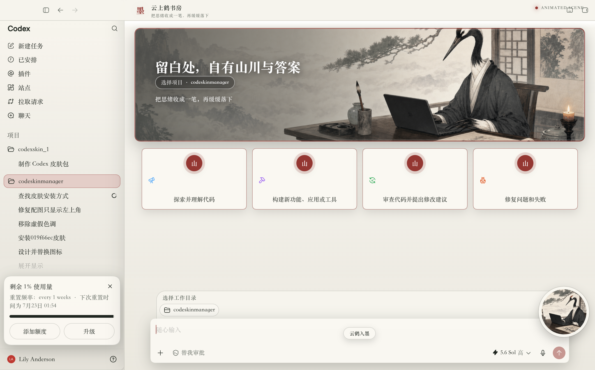
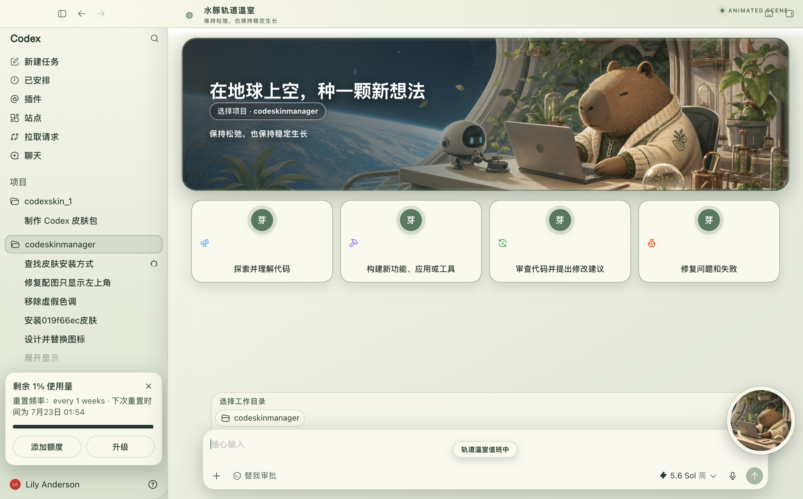

# Codex Skin Builder

**给 Codex 做一套真正能运行的主题。** 皮肤构建 Skill · macOS · 本机 CDP 注入 · 不改官方安装包

一张图，一种工作氛围。把角色图片、截图、网页或视觉灵感，制作成可安装、可验证、可恢复的 Codex 桌面动态皮肤。

> 非 OpenAI 官方产品。不修改、替换或重签官方 Codex `.app`，也不修改 `app.asar`。

## 效果预览

以下均为当前项目产出的真实 Codex 皮肤界面。侧边栏、功能卡、项目选择器、输入框与任务区域保留原生 DOM 和原生交互，不是整窗截图覆盖。



<sub>云上鹤书房 · 水墨留白与暖灰工作台</sub>



<sub>水豚轨道温室 · 太空舷窗与植物实验室</sub>


<sub>月薪喵打工人 · 暖黄办公室与轻量金币动效</sub>

## 它能做什么

- **真·可交互**：侧栏、建议卡、项目选择器、输入框和任务内容仍是 Codex 原生控件。
- **从素材到皮肤包**：以 PNG、GIF、截图、网页或视觉简报为输入，生成可独立分发的完整目录。
- **可定制**：脚手架会重命名 CSS/JS/shell 标识、状态目录、启动器、清单和素材，避免不同主题互相冲突。
- **可验证**：包含静态检查、隔离安装、截图验证和安装/恢复往返清单。
- **可恢复**：提供实时清理与完整基础主题恢复路径。
- **相对安全**：通过只监听 `127.0.0.1` 的 Chromium DevTools Protocol 注入，不修改官方二进制和签名。

## 快速开始

要求：macOS 12 或更高版本、官方 Codex 桌面版、Python 3。构建 GIF 与运行部分脚本需要 Node.js 18 或更高版本。

### 1. 克隆项目

```zsh
git clone https://github.com/kongxcer555/codex-skin-builder.git
cd codex-skin-builder
```

### 2. 准备主视觉

准备一张横向 PNG 源图和对应的循环 GIF。推荐让主体位于画面右侧 45–55%，左侧保留 Codex 原生文案所需的负空间；图片中不要嵌入文字、Logo、界面边框或水印。

### 3. 生成独立皮肤包

```zsh
python3 scripts/scaffold_skin.py \
  --name "Codex 示例主题" \
  --slug "codex-example-skin" \
  --description "示例角色与暖色工作台主题" \
  --source /absolute/path/source.png \
  --gif /absolute/path/hero.gif \
  --output /absolute/path/codex-example-skin
```

`--slug` 只接受小写字母、数字和连字符，输出目录必须尚不存在。生成结果包含素材、主题 CSS、注入器、安装/启动/验证/恢复脚本、`skin.json` 和 skill 元数据。

### 4. 调整主题并验证

主要编辑生成包中的：

- `assets/<key>-skin.css`：色板、卡片、输入框与装饰动效。
- `assets/renderer-inject.js`：主题节点、可见文案和幂等注入逻辑。
- `skin.json`：皮肤名称、描述、预览图和默认端口。

发布前按 [`references/qa.md`](references/qa.md) 检查 Shell/JavaScript 语法、清单路径、PNG/GIF、隔离安装/恢复、回环端口和创建者机器绝对路径。只有获得明确授权后，才应重启当前 Codex 窗口或执行实时注入验证。

## 内置参考实现

`assets/reference-skin/` 是脚手架实际复制和改写的完整 macOS 参考运行时，不只是演示素材。

| 内容 | 路径 | 用途 |
| --- | --- | --- |
| 脚手架 | `scripts/scaffold_skin.py` | 从参考运行时生成新的独立皮肤包 |
| 动态主视觉 | `assets/reference-skin/assets/salary-cat-hero.gif` | 1264 × 553、12 帧循环 GIF |
| 静态回退图 | `assets/reference-skin/assets/salary-cat-source.png` | 1942 × 809，适配“减少动态效果” |
| 主题与注入器 | `assets/reference-skin/assets/` | CSS、渲染注入与主视觉素材 |
| 生命周期脚本 | `assets/reference-skin/scripts/` | 构建、安装、启动、验证和恢复 |
| 架构说明 | `references/runtime-architecture.md` | CDP、WebSocket、注入与清理边界 |
| 视觉工作流 | `references/visual-workflow.md` | 构图、色板、素材与动效建议 |
| 公开安全 starter | `references/public-safe-starters.md` | 从可分发素材生成可发布皮肤包，避免泄露私有 Codex 截图 |

直接安装内置“月薪喵”参考皮肤：

```zsh
cd assets/reference-skin
/bin/zsh scripts/install-salary-cat-skin.sh
```

完整安装、验证和恢复命令见 [`assets/reference-skin/README.zh-CN.md`](assets/reference-skin/README.zh-CN.md)。

## 安全边界

- CDP 仅绑定 `127.0.0.1`；主题运行期间不要运行可能连接本机调试端口的不可信程序。
- 不修改、不解包、不重签官方 Codex 应用或 `app.asar`。
- 不在未经授权的情况下关闭或重启用户正在使用的 Codex 窗口。
- 装饰性注入元素保持 `pointer-events: none`，不阻断原生操作。
- 初次安装测试使用隔离的 `HOME` 与桌面目录。
- 每个生成包都必须保留实时清理和完整恢复路径。

## 许可与声明

- 软件源代码采用 [`LICENSE`](LICENSE) 中的 MIT License。
- 详细权利边界见 [`NOTICE.md`](NOTICE.md)。MIT License 不授予 OpenAI/Codex 商标、官方应用二进制、用户提供图片、第三方作品、角色形象或展示图的使用权。
- 本项目为非官方定制工具，与 OpenAI 无隶属、认可或赞助关系；Codex、ChatGPT 及相关权利归其权利人。
- 使用人物、角色、品牌或第三方图片制作可公开分发的主题前，请自行确认肖像权、著作权与商标授权。

---

挑一张图，把你的 Codex 变成今天想要的样子。
